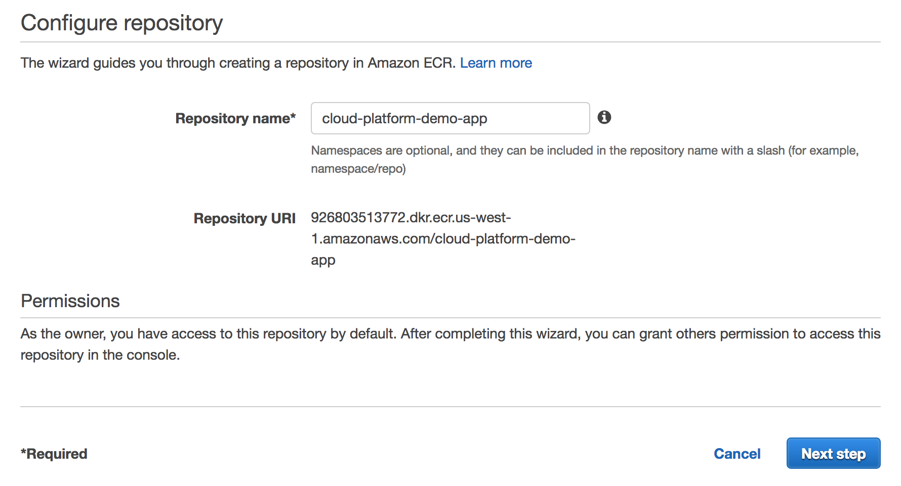
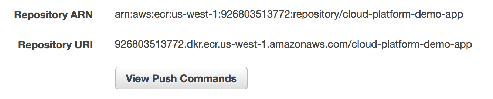

# Deploying an application to the Cloud Platform

## Overview

The aim of this guide is to walkthrough the process of deploying an application into the Cloud Platform.

This guide uses a pre-configured application as an example of how to deploy your own.

## Prerequisites

This guide assumes the following:

* You have [created an environment for your application](/cloud-platform/env-create)
* Kubectl is installed and configured.
* Docker is installed and configured.
* Authentication with the cluster has been established.
* Access to AWS, with ECR upload permissions.
* AWS CLI configured with account credentials.

If you are not deploying your own application and would like to deploy the example application, clone the following repo:

[https://github.com/ministryofjustice/cloud-platform-demo-app](https://github.com/ministryofjustice/cloud-platform-demo-app)

## Pushing application to ECR

To deploy an application to the Cloud Platform, firstly the application image needs to be retrievable from a repository.

Amazon's ECR, within ECS is where all of the application images used by the Cloud Platform are stored.

### Creating or choosing a repository

**NOTE:** *When you are uploading your image to ECR you'll need a credential from the cloud platform team, ask in the `#cloud-platform-users` channel in Slack*

On the ECR start page you will have the option create a new repository, or to search for an existing one.

Create a new repository, and name it something relevant:



After confirmation that the repository was successfully created, ignore the list of commands and click **Done**, at the bottom of the page.

### Authenticating with the repository

Select your newly created repository from the displayed list.

Within the repository, you will see the following section with values unique to you:



Click the **View Push Commands** button.

You will then be presented with a list of preconfigured terminal commands for you to run.

Copy the first command. You will need to add `--profile yourAWSProfile` if the AWS account you're pushing to is not the default in your CLI:
*Note: You can also set the environment variable `AWS_ENVIRONMENT=<yourAWSProfile>`*

`aws ecr get-login --profile mojdsd --no-include-email --region eu-west-1`

Execute the command, then proceed to execute the Docker login command provided in the Terminal.

`Login Succeeded` will confirm you have been authenticated with the repository.

### Pushing the Docker image to the repository

Ensure the Docker image for your application has been built and is stored locally on your machine.

Now we need to tag the image with the tag provided by ECR, so it can be pushed into the correct repository.

View the **Push Commands** again, and modify the fourth command provided, ensuring the first tag is the one currently used on your machine:

`docker tag cloud-platform-demo-app:latest 926803513772.dkr.ecr.us-west-1.amazonaws.com/cloud-platform-demo-app:latest`

Finish by running the fifth command provided, to push the image to your repository.

`docker push 926803513772.dkr.ecr.us-west-1.amazonaws.com/cloud-platform-demo-app:latest`

A quick refresh of ECR, and your image should now be displayed.

## Configuring deployment files

To deploy an application to the Cloud Platform, a number of deployment files must first be configured.

These deployment files will make reference to your application's Docker image and handle configurations, such as ports and host resolving.

This guide will analyse the deployment files for `Cloud-Platform-Reference-App`.

The deployment files can be used as a basic template for your application, and can be found at:

[https://github.com/ministryofjustice/cloud-platform-reference-app](https://github.com/ministryofjustice/cloud-platform-reference-app)

*Tip:* You can find more deployment config info [in the kubernetes developer documentation](https://kubernetes.io/docs/tasks/run-application/run-stateless-application-deployment/).

### Deployment

Deployment files are used to specify core information about an application that is being deployed to the Cloud Platform.

See the contents of the `deployment.yml` file below:

```Yaml
apiVersion: extensions/v1beta1
kind: Deployment
metadata:
  name: cp-demo-app
spec:
  replicas: 1
  template:
    metadata:
      labels:
        app: cp-demo-app
    spec:
      containers:
      - name: cp-demo-app
        image: 926803513772.dkr.ecr.us-west-1.amazonaws.com/cloud-platform-demo-app:latest
        ports:
        - containerPort: 80
```

If you are using the file as a template for your own application, replace the `cp-demo-app` tags with ones suited to your application.

For the value of the `image:` key, you will see the Repository URI, which has been provided by ECR.

If you are using the file as a template for your own application, replace the value of `image:` with the Repository URI of your application, found in ECR.


### Service

Service files are used to specify port and protocol information for your application and are also used to bundle together the set of pods created by the deployment.

See the contents of the `service.yml` file below:

```Yaml
kind: Service
apiVersion: v1
metadata:
  name: cp-app-demo-svc
  labels:
    app: cp-app-demo-svc
spec:
  ports:
  - port: 80
    name: http
    targetPort: 80
  selector:
    app: cp-demo-app
```

If you are using the file as a template for your own application, replace the `cp-demo-app-svc` tags with ones suited to your application.

Also, ensure the `selector:` app tag is the same as specified in the `deployment.yml`.

*Tip:* You can find more info on service definition in the [kubernetes docs](https://kubernetes.io/docs/tasks/access-application-cluster/service-access-application-cluster/).

### Ingress

Ingress files are to use to define external access to the application.

See the contents of the `ingress.yml` file below:

```Yaml
apiVersion: extensions/v1beta1
kind: Ingress
metadata:
  name: cp-demo-app-ing
spec:
  rules:
  - host: cp-demo-app.integration.dsd.io
    http:
      paths:
      - path: /
        backend:
          serviceName: cp-demo-app-svc
          servicePort: 80
```

If you are using the file as a template for your own application, replace the `cp-demo-app-ing` tag with one suited to your application.

Also, ensure the `serviceName:` tag is the same as specified in the `service.yml`.

*Tip:* You can find more info on ingress in the [kubernetes docs](https://kubernetes.io/docs/concepts/services-networking/ingress/)

## Deploying application to the cluster

With all of the deployment files configured, you can now deploy your application to the Cloud Platform.

Start by listing the namespaces on the cluster you are connected to:

`kubectl get namespaces`

The list that gets returned should include the environment you [created earlier](/cloud-platform/env-create), here we assume it is called `my-app-dev`.

To deploy your application run the following command, that points to the directory where the deployment files are stored, in the [reference app]() they are in the `kubectl_deploy` directory:

`kubectl create -f kubectl_deploy --namespace my-app-dev`

You have to specify the namespace you want to deploy to, this should be the namespace of the environment you created.

Confirm the deployment with:

`kubectl get pods --namespace my-app-dev`

## Interacting with the application

With the application deployed into the Cloud Platform, there are a few ways of managing it:

* **View pods** - `kubectl get pods --namespace my-app-dev`
* **Check host** - `kubectl get ing --namespace my-app-dev`
* **Delete application** - `kubectl delete -f deployment-files --namespace my-app-dev`
* **Shell into container** - `kubectl exec --stdin --tty --namespace my-app-dev pod-name -- /bin/bash`
